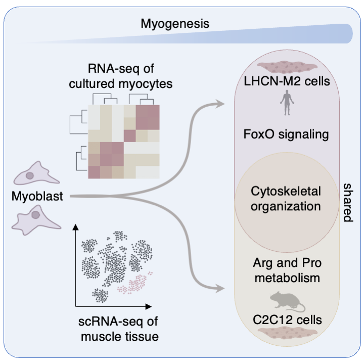

# Myogenesis Human and Mouse
A comparative RNA-seq dataset of human (LHCN-M2) and mouse (C2C12) myogenesis. 
Project Overview: Comparative Transcriptomics of Myogenesis
Skeletal muscle formation and regeneration is a tightly regulated process involving extensive transcriptional reprogramming. While the transition from proliferating myoblasts to mature myotubes is well-studied, a stringent comparative analysis between human and mouse myogenic landscapes has been lacking.

This repository hosts a high-quality RNA-sequencing dataset and an interactive exploration tool (R Shiny) profiling myogenesis in:

Human: LHCN-M2 myogenic cells.

Mouse: C2C12 myogenic cells.

  

# Key Features of the Dataset:

Unified Protocol: Samples were collected from proliferating myoblasts, early differentiation, and mature myocytes using identical protocols to ensure maximum comparability.

Divergent Trajectories: While global features are shared, our analysis reveals distinct species-specific programs (e.g., metabolic/stress-related suppression in humans vs. inflammatory/contractile enrichment in mouse).

In Vivo Comparison: Bulk RNA-seq data is integrated with tissue-derived single-cell muscle datasets to distinguish conserved biological programs from culture-specific artifacts.

# Interactive Exploration

To facilitate the study of these transcriptional shifts, we provide a Shiny Application (found in Dataforshiny). This tool allows researchers to:

Search for any gene of interest (Human/Mouse orthologs).

Visualize expression distributions through interactive Violin Plots.

Compare the timing and intensity of transcriptional reprogramming across species without requiring local computational environments.

If you want to visualize the data on your local computer without writing any code, please open the directory named Dataforshiny,
the first lines of the code include a detailed, step-by-step guide on how to launch the interactive dashboard using RStudio.
